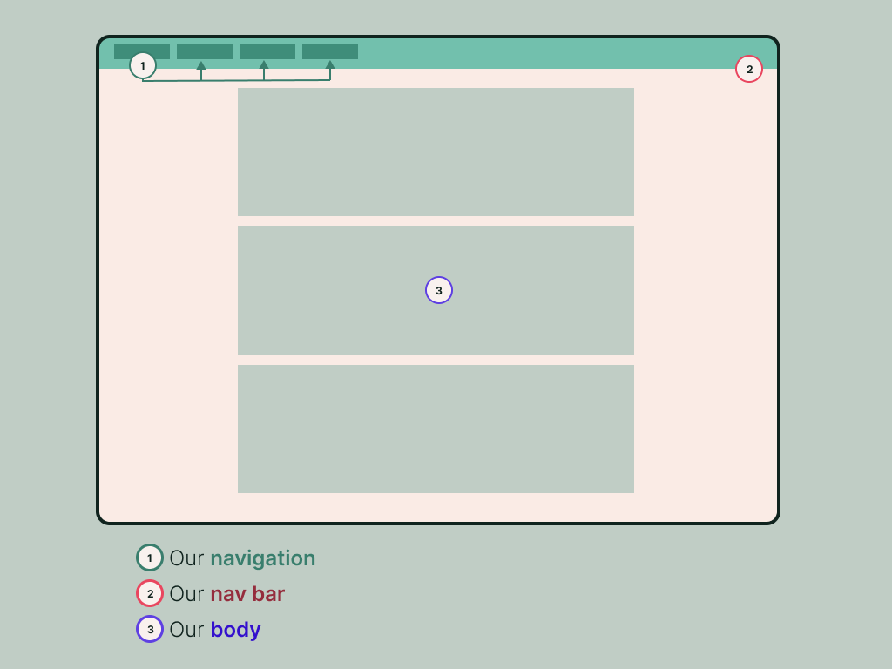
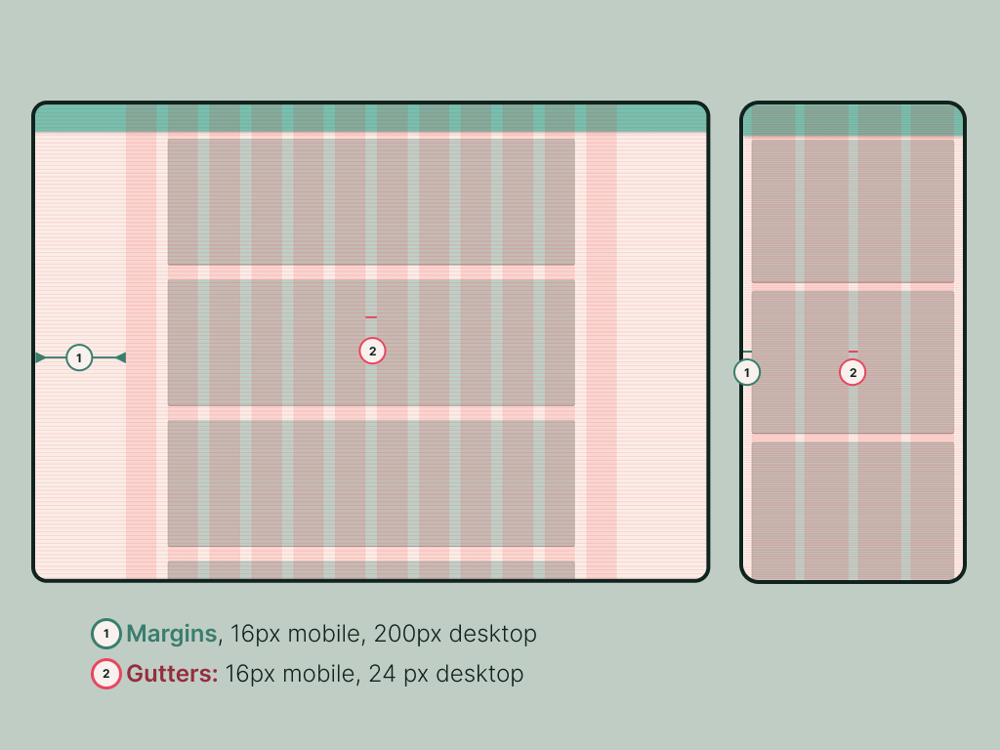
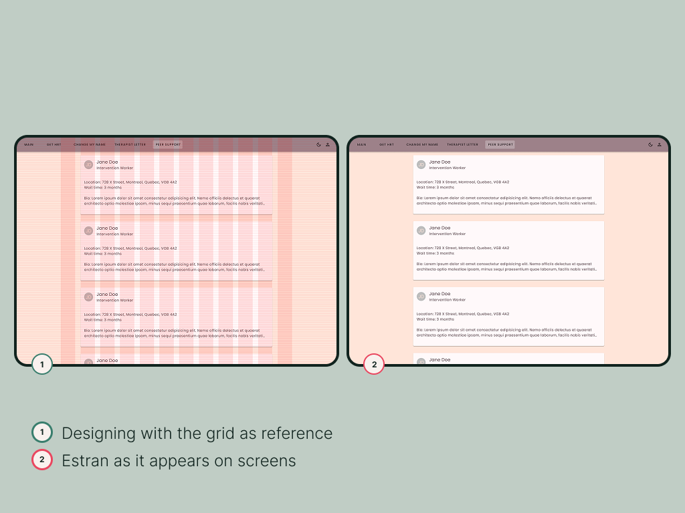
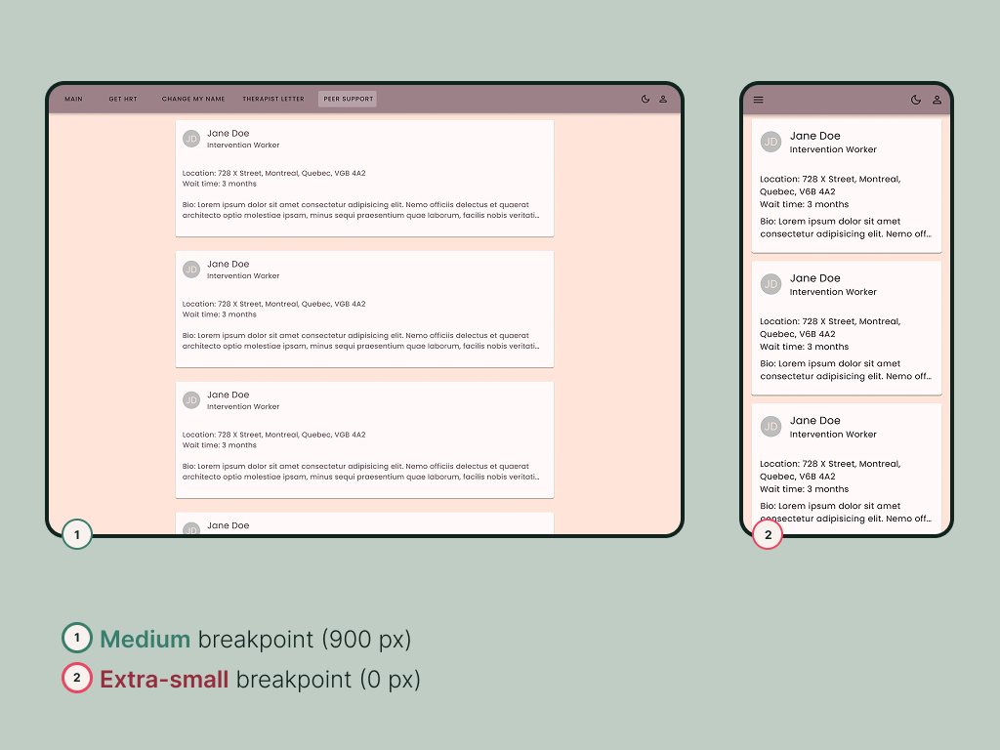

# Trans Access Site Prototype

## What Is This App?

This is a prototype of CURE's Trans Access Site. We've built out a basic site architecture as a foundation for future work. As a finished product, this site will help trans people in Quebec find accessible, quality medical, legal, and community care.

The live version of this app can be found [here.](https://trans-access-site.web.app)

## Tech We Use

### What We Assume You Already Know:

Beyond a knowledge of HTML, CSS, and JS basics, we hope to provide enough information, eventually, that someone who only knows these technologies can contribute to the application, for now here are some basics.

#### HTML:

Hyper Text Markup Language (HTML) is the standard coding language for describing the structure of web documents, and its main purpose is to structure content using elements and attributes. HTML elements are outlined by tags written using angle brackets (< and >). An element contains the opening tag, closing tag, and all the content between them, including any nested elements. Attributes provide more information or instructions about an element, and we add them inside the opening tag as name/value pairs that help define how the content appears, behaves, and is accessed by assistive technologies.

#### CSS:

Cascading Style Sheets (CSS) is a stylesheet language that controls how elements should look and behave in HTML documents. For example, it controls elements' dimensions, spacing, visual borders, background appearance, and how content is displayed. CSS is important, and if we don't provide a stylesheet, every web browser applies a default stylesheet to HTML documents to make sure they're readable. You can read more about CSS [here.](https://web.dev/learn/css/welcome?authuser=5)

#### JavaScript:

JavaScript is an interactive programming language. It updates content without refreshing the page all over again, gives us the ability to click buttons, fill out forms, and basically add actions to the structure of the app. We use it for these exact reasons! :) You can read more about JavaScript [here.](https://web.dev/learn/javascript/introduction?authuser=5)

#### How websites work (non-React):

A traditional website depends on the three base technologies that work together: HTML, CSS, and JavaScript:

- When a user types a URL in the browser, the website’s loading process starts when the browser sends a request to the web server.
- The server then responds by returning an HTML file linked with CSS/JS files to the browser.
- The browser reads the HTML, makes an editable copy in memory, and builds the Document Object Model (DOM), known as the tree-like structure of the page.
- The Document Object Model (DOM) is a programming interface for web documents, it is a live copy of a webpage that JavaScript creates to edit and change the original website you see on screen.
- The DOM is important because it lets us update content, respond to users, and change the parts that need editing. You can read more about the Document Object Model [here.](https://www.w3schools.com/js/js_htmldom.asp)
- The browser then does a step called CSS Object Model construction (CSSOM), where it takes the linked CSS files and applies styles to the render tree (DOM).
- The browser runs JavaScript to add dynamic behaviour and modify any DOM/CSSOM if needed before combining them together, rendering the page, and presenting the final webpage on your screen.

### React

React is a modern web framework that allows you to create advanced web browser applications. It is the basis for all of our work. React itself is a JavaScript library for building user interfaces, where the rendering logic and markup are contained inside components.

For documentation please see React's excellent official [getting started guide](https://react.dev/learn) which is designed for beginners and very easy to use. In this section we have information about React, and different definitions that will help you get familiar with our work process and how it’s going so far.

#### The single-page app

A single-page app (SPA) is when a website loads everything on one HTML page and continuously updates content as the user interacts, without reloading the entire page from the server. This is different from traditional HTML, which loads new pages based on interactions. Instagram is an example of a SPA; it loads everything initially and then updates specific parts of the screen based on user interactions and external data from the database. Our website works the same way. Please note that we sometimes change the URL in the address bar, but this does not involve a new page load — see React Router below for an explanation of this process.

#### Components:

Components are a way of breaking down the code that will render as html elements. This keeps the code clean and easily navigable by splitting page elements or complex logic into multiple files. It also allows for modularity, for instance, letting us make a "doctor listing card" component which can then be re-used and filled with the relevant data. You can also create your own components too, we mostly use a pre-built components library called MUI, but in specific cases, we create our own, and sometimes customize it for our needs. For example, we customized the app bar in our website to hold all of the navigation buttons. You can read about how it works and why we use it in the MUI section below.

#### Converting JSX to HTML:

JSX is a syntax extension that looks like HTML but follows JavaScript rules. We use it because it allows you to write markup-like code within JavaScript, which is something regular HTML can’t do. Each component is a JavaScript function that includes this markup in a single file, updating in real-time with each edit. That's why JSX has stricter rules than HTML, such as requiring a single root element by wrapping everything in one parent tag or a fragment, closing all tags with a /, and ensuring variable names do not contain dashes; for example, style={{ color: white }} becomes sx={{ color: ‘primary.contrastText’ }} so it can apply the MUI’s styling guidelines, which is what we use to update the HTML page we open and interact with. Once JSX is transformed into JavaScript objects, React renders the markup to the browser and uses it to update the document object model (DOM) dynamically.

### MUI

MUI is an open-source component library for React, implementing Google's Material Design 2.0 spec. It has a full suite of components designed to be production-ready, and it also comes full of customization options, so you can build your own customized system using it. MUI's documentation is [here.](https://mui.com/material-ui/getting-started/)

#### Why we chose MUI:

The advantages of Material UI:

- A stable library with many contributors and fast shipping – we can trust it to work well and receive regular bug fixes. Contributors also solved a lot of common issues, which gives us time to focus on our project instead of reinventing UI elements.
- Visually appealing by default, where they make sure the components meet the highest standards of form and function, but also branch off from the official Google spec to offer a more practical component variation, so it can prevent everything from looking alike.
- The library is highly customizable, which also makes our work easier since we don’t have to write extensive custom component code. Read below about material design, and why we chose to use it.

#### Material Design:

- Material Design is a design system created by Google to help teams create high-quality digital experiences. It offers a cohesive set of guidelines for designing functional, consistent, and visually attractive user interfaces across web, mobile, and other digital platforms. It draws inspiration from the textures of the physical world, including how surfaces reflect light and cast shadows.
- Google's material design makes a wide range of good design choices so we don't have to. However, It does not offer a code implementation of their system, but since MUI is an independent open-source project, it implements that system in React, and it also gives us access to a pre-built large library of working React components with lots of customization features that we can use to make it look exactly how we want.
- The components already include accessibility features, and work on both desktop and mobile easily, all this frees us from low-level component building, so we can focus our coding on the higher-level design implementation, and build our code by putting together their components. It’s like building a house – you get everything delivered, from the concrete and wood, all the way to the tiles and the paint, so you can start building the house, instead of making every part from scratch yourself.

Material UI provides systematic tools that help us create responsive and visually appealing interfaces. Some of the most important concepts in our work include layout and breakpoints, theming, typography, the grid system, and styling through the sx prop.

#### Layouts:

- Material Design layouts use components and spacing to create consistency across platforms, environments, and screen sizes. Layouts have three main regions: app bars, navigation, and body. They are the foundation when it comes to building an interactive experience.
- The body region is used to display most of the content in the app, such as buttons, lists, and cards, the navigation region helps the user navigate between important sections, and the app bar is used to display and organize buttons that help users take action on elements located in the body region. For our app, we placed all of our navigation in an app bar at the top.
  
- Material Design’s responsive layout grid is an interactive grid that dynamically responds to users' input and adapts to screen sizes to ensure consistency across all platforms, and it’s made up of three elements: columns, gutters, and margins.
- Content is placed within columns, and the number of columns adjusts automatically at set breakpoints, though these rules are determined by developers. We use twelve columns for desktop applications and four for mobile ones. Margins are on the sides of the page and have fixed widths. The gutters are typically small, located between columns, and also have fixed widths. We use margins (left-ride sides) = 16px mobile, 200px desktop. gutters (between columns) = 16px mobile, 24 px desktop.
  
  

#### Breakpoints:

- A breakpoint is the screen size limit determined by specific layout requirements; the layout adjusts to suit different screen sizes. Our design is based on MUI’s grid system, and uses four columns on mobile, and twelve columns on desktop.
- Each breakpoint range determines the number of columns, margins, and gutters for each display size.
- We're using MUI's breakpoint system as defined by its default theme to render elements designed for computer screens, like DesktopNavLinks.js, at desktop screen size, and elements designed for phone screens, like MobileNavLinks.js, on phone screens. Each breakpoint (a key) matches with a fixed screen width (a value): extra-small: 0px, medium: 900px.
  

#### The Grid system:

- The responsive layout grid we use adapts to screen size and orientation, and the grid component works with our twelve-column layout, where they are configured with multiple breakpoints to specify the column span of each child.
- We use the baseline grid to align text and components vertically, like the lines on paper. And the responsive layout grid for different screen sizes like mobile, tablet, and desktop.
- When using the grid, we set up the columns to match breakpoint counts and the gutters for mobile and desktop. Then, the Material-UI’s grid component applies what we did to create how we want people to see our content on different screen sizes.
- Technically MUI renders things using [CSS flexbox](https://css-tricks.com/snippets/css/a-guide-to-flexbox/) under the hood (and not css grid), the column grid as we use it is instead a reflection of our design decisions.

#### Theming:

- MUI theming allows us to customize Material Design so it can align with our app and reflect what we want to present. We use it to change aspects of the UI like colour and typography, and apply our designs throughout the user experience.
- MUI comes with a default baseline theme that we have further customized. You can learn more about the customization process here.
- Our CustomThemeProvider.js is a parent to the rest of the app – the app is nested within the CustomThemeProvider in Index.js in accordance with React’s UseContext hook. This lets the MUI default theme, with the modifications we made to it, apply to the entire app.
- If you look in palette.js, you can see how we have customized MUI’s default theme to change the color palette:

```
  dark: {
    mode: "dark",
    background: { default: "#45435a", paper: "#4E4C67" },
    text: { primary: "#eeebfc" },
    primary: { main: "#b689a2", contrastText: "#282735" },
    secondary: {
      main: "#3419A9",
      light: "#3A3659",
      dark: "#1A0D54",
      contrastText: "#eeebfc",
    },
    progressBar: { main: "#5E40E2", light: "#EEEBFC" },
  },
```

- Here, we’re using the same syntax as the code for [MUI’s default dark mode theme](https://mui.com/material-ui/customization/default-theme/), but we’re changing the colors to match the dark mode color palette that our designers created!

#### Typography:

- As a basis for our typography, we use Material Design’s type scale system, which consists of thirteen styles that are reusable categories of text to choose from.
- We use Poppins as our default font.
- We specify how our typography looks in the code using CSS properties like font-family, font-size, and font-weight.
- MUI’s typography components have standardised text styles that utilise variants like h1, h2, h3. We used these variants, customized our theme, used the sx prop for one-off adjustments, and then chose the type style to create our code with the Poppins font.
- Similarly to how we customize MUI’s default color palette, we define all our own custom typography in typescale.js, using the same syntax as MUI’s default theme object, and then apply it in CustomThemeProvider.js.
- To see how typography is used in our code, how we interact with it through components to choose type styles, and how it is introduced in the theming object, check out our CustomThemesProvider.js and typescale.js files.

#### Styling through the sx prop:

- The sx prop is a shortcut for defining custom styles that have access to the theme, and it allows us to work with CSS packages that give us theme-aware values and breakpoint shortcuts.
- Basically it lets us make little tweaks and customizations to individual components using normal CSS rules. For example, the following code snippet will create a Box (MUI's version of an HTML div), and use the sx prop to apply custom paddingTop and paddingBottom properties to it: `<Box sx={{ paddingTop: 9, paddingBottom: 9.5 }}>`
- The sx prop also lets us do theme integration, responsive designs, CSS shorthand, and pseudo-classes and states if we ever need them.
- The sx prop styles get converted to plain CSS at runtime, and we use it when we want to do quick prototyping, margins, and responsive layouts.

### React Router

React Router is a routing library that is primarily used to make the routes that you see in the URL bar of the browser interact with, and provide their own data to React, in order to display particular pages correctly.

React Router has a decent [official tutorial](https://reactrouter.com/6.28.0/start/tutorial), but we actually recommend reading their [main concepts page](https://reactrouter.com/6.28.0/start/concepts) to really understand what is going on.

#### BrowserRouter

React itself renders a "Single Page App", using only one HTML page behind the scenes, and using JavaScript to change what that page looks like. This is powerful but takes away the ability for the user to enter URLs to access specific pages of our app, since there is only one webpage loaded.

React Router's BrowserRouter component gives us back this URL functionality, by intercepting the load of a new page when the user enters a sub-url on our domain, and sending that data to React instead, to load page and component views itself. You can read more about the React Router docs [here](https://reactrouter.com/6.10.0/start/concepts), and its component documentation [here](https://reactrouter.com/6.10.0/router-components/browser-router).

#### How BrowserRouter works in our app:

- BrowserRouter uses the browser’s [history API](https://developer.mozilla.org/en-US/docs/Web/API/History_API) to update the URL without reloading the full pages, keeping us within a single page behind the scenes and enabling the client side routing in our app.
- When a user clicks on a link, BrowserRouter matches that URL link with the equivalent React component for it, and generates it to keep everything running.
- So, although it looks to the user like they are navigating to different “pages” based on what they see in the URL bar, on a technical level they are always on one page, and we are changing their view by replacing what components are visible, and changing the URL in the URL bar using the history API.
- So we have a single page app with the illusion of multiple pages.

#### A Note on RouterLink Import:

You might notice this line of code throughout the site: `import { Link as RouterLink } from "react-router-dom"`. "react-router-dom" is a React Router component that acts as an anchor link to other routes (pages). However, because MUI also has a component called Link, used to style anchor text, we import it as RouterLink across the entire project to avoid namespace confusion. This is MUI recommended practice.

## Our sponsors

We have been funded by:

- CURE Concordia
- The Concordia Council on Student Life
- Campus Ex/El Office
- SHIFT
- Emplois Été Canada
- Women and Gender Equality Canada
